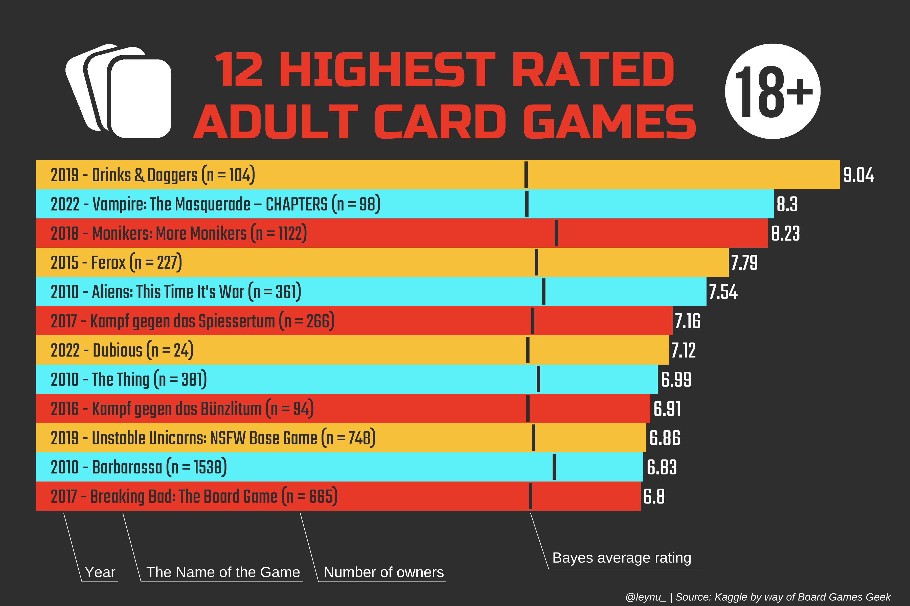

# Jan2022_board_games #TidyTuesday

The data this week comes from [Kaggle](https://www.kaggle.com/jvanelteren/boardgamegeek-reviews/version/3?select=2022-01-08.csv) by way of [Board Games Geek](https://www.boardgamegeek.com/), with a hattip to [David and Georgios ](https://github.com/rfordatascience/tidytuesday/issues/382#issuecomment-1020305849).

